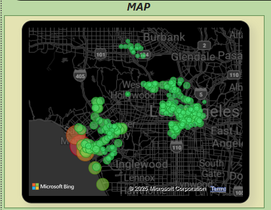

La Metro Bike Share Micromobility Data Analysis (Q3 2024)

This project is my first data analysis project as a freshman industrial engineering student. I wanted to apply the basic-level skills I’ve learned in SQL (PostgreSQL), Power BI, and Excel to extract meaningful insights for operations, marketing, and user behavior using LA Metro Bike Share data.

---

##  Tools Used

- **PostgreSQL**: Data loading, cleaning, and querying  
- **Power BI**: Dashboards and interactive visualizations  
- **Excel**: Pre-processing and additional aggregations

---

## Dataset

- `metro-trips-2024-q3.csv`  
- `metro-bike-share-stations.csv`  

These include ride-level data (start time, duration, bike type, route), station locations, and time-based usage breakdowns.

---

## Workflow Summary

### 1. Import & Clean Data in PostgreSQL

```sql
-- Sample: create main trips table
CREATE TABLE bike_trips (
    trip_id SERIAL PRIMARY KEY,
    duration INT,
    start_time TIMESTAMP,
    end_time TIMESTAMP,
    start_station TEXT,
    end_station TEXT,
    bike_id TEXT,
    trip_route_category TEXT,
    passholder_type TEXT,
    bike_type TEXT
);
```

```bash
-- Import CSV into PostgreSQL
\COPY bike_trips(duration, start_time, end_time, start_station, end_station, bike_id, trip_route_category, passholder_type, bike_type)
FROM 'C:/path/to/metro-trips-2024-q3.csv' WITH (FORMAT csv, HEADER true);
```

```sql
-- Create stations table
CREATE TABLE stations (
    kiosk_id INT PRIMARY KEY,
    kiosk_name TEXT,
    go_live_date DATE,
    region TEXT,
    status TEXT
);

-- Import stations CSV
\COPY stations(kiosk_id, kiosk_name, go_live_date, region, status)
FROM 'C:/path/to/metro-bike-share-stations.csv' WITH (FORMAT csv, HEADER true);
```

---

### 2. Analyze with SQL

```sql
-- Most popular stations
SELECT start_station, COUNT(*) AS trip_count
FROM bike_trips
GROUP BY start_station
ORDER BY trip_count DESC
LIMIT 5;
```

```sql
-- Peak trip hour
SELECT EXTRACT(HOUR FROM start_time) AS hour, COUNT(*) AS trip_count
FROM bike_trips
GROUP BY hour
ORDER BY trip_count DESC;
```

```sql
-- Join trips with station metadata to get region
SELECT bt.*, s.region
FROM bike_trips bt
JOIN stations s
ON bt.start_station = s.kiosk_name;
```

---

### 3. Create Dashboard in Power BI

The joined dataset (trip data with station regions) was exported from PostgreSQL and imported into Power BI. This enabled visualizations by station region and metadata.

### Dashboard Overview


### Region Heatmap




**Key Visuals**:
- Map of trip counts by station  
- Hourly trip heatmap  
- Avg trip duration by passholder type  
- Trip route category distribution

---

## Key Insights

- **Total Trips:** 134,918  
- **Total Ride Time:** 79,087 hours  
- **Avg Duration:** 35.17 minutes  
- **Most Common User Type:** Monthly Pass  
- **Most Used Route Type:** One Way  
- **Peak Hour:** 17:00  
- **Busiest Station:** ID 4214 (7,439 rides)

---

##  Contact
- GitHub: [github.com/ayberkaydemir](github.com/Aydemirayberk)  
- LinkedIn: [[linkedin.com/in/ayberkaydemir](linkedin.com/in/ayberkaydemirr)

---
